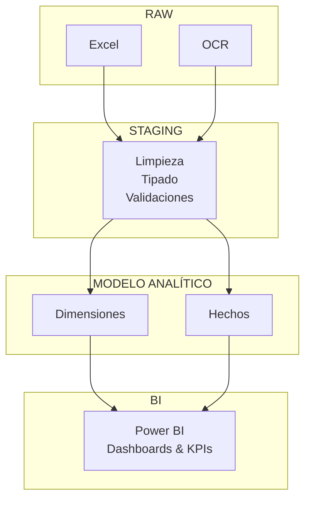

# Análisis Operativo de Reparto – Pipeline ETL y Business Intelligence

Este proyecto implementa un pipeline analítico end-to-end para el análisis de operaciones de reparto, desde la recolección de datos reales hasta la visualización de métricas clave en Power BI.

Incluye una aplicación de ingesta desarrollada en Streamlit con soporte de OCR, una capa de staging para limpieza y validación de datos, un modelo dimensional en esquema estrella y un dashboard orientado a eficiencia operativa y rentabilidad.

El objetivo es analizar rendimiento operativo, tiempos de entrega y rentabilidad por turno, zona y proveedor.

>**Privacidad de los datos**
>Los datos utilizados corresponden a registros reales y no se incluyen en este repositorio.
Las direcciones fueron anonimizadas y reemplazadas por códigos postales y zonas operativas.

---

## 🎯 Objetivos

- Recolectar y estructurar datos operativos de reparto
- Construir un pipeline ETL reproducible
- Modelar los datos en esquema estrella
- Analizar indicadores como ingreso por hora y demora por proveedor
- Preservar la privacidad de datos sensibles

## 🧱 Arquitectura del Pipeline




## 📁 Estructura del repositorio
```
proyecto-pedidos/
├── app/                   # App de streamlit para la carga de datos
├── src/
│   ├── ingestion/         # Scripts de extracción OCR y lectura de .xlsx
│   └── etl/               # Scripts de staging y modelado de datos
├── data/
│   ├── raw/
│   ├── stage/
│   ├── marts/
│   └── lookups/
├── README.md
├── requirements.txt
└── .gitignore
```

## 🧠 Modelo de datos

El modelo sigue un esquema estrella con las siguientes tablas:

**Dimensiones**
- `dim_tiempo`
- `dim_proveedor`
- `dim_zona`
- `dim_clima`

**Hechos**
- `fact_turnos`
- `fact_pedidos`


## ➡️ Ejecución del pipeline
1. Cargar registros mediante la app Streamlit.
    ```bash
    streamlit run app/streamlit_app.py
    ```
2. Ejecutar capa de staging para normalizar los datos
    ```bash
    python -m src.etl.stage_raw
    ```
3. Crear tablas de dimensiones del modelo 
    ```bash
    python -m src.build_dimensions
    ```
4. Crear tablas de hechos del modelo
    ```bash
    python -m src.build_facts
    ```
5. Consumir archivos .csv desde Power BI

## 🛠️ Tecnologías utilizadas

- Python
- Pandas
- Streamlit
- OCR (Tesseract)
- Power BI
- Git/GitHub
